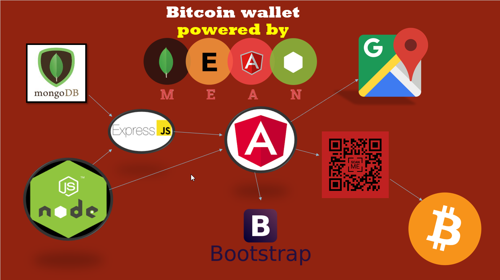

# **Bitcoin Wallet**

---

# **Introduction**
Welcome to our Crypto-Currency wallet application. The focus of this application is to offer an easy to use, intuitave user experience. While offering education on the trading and buying of Crypto-Currencies. This wallet application will be mainly dealing with storing and sending [Bitcoin](https://en.wikipedia.org/wiki/Bitcoin).

### What is [Bitcoin](https://en.wikipedia.org/wiki/Bitcoin)?
Here is a brief video to explain some questions you make have about bitcoin.

---

## **Technologies**

The term MEAN stack refers to a collection of JavaScript based technologies used to develop web applications. [1] The MEAN stack is MongoDB, Express.js, Angular 2, and Node.js. Because all components of the MEAN stack support programs are written in JavaScript, MEAN applications can be written in one language for both server-side and client-side execution environments. [2]

### MongoDB

MongoDB stores data in flexible, JSON-like documents, meaning fields can vary from document to document and data structure can be changed over time. MongoDB is a distributed database at its core, so high availability, horizontal scaling, and geographic distribution are built in and easy to use. MongoDB is free and open-source. [3]

### ExpressJS

Express.js, or simply Express, is a web application framework for Node.js, released as free and open-source software. It is designed for building web applications and APIs. It is in fact the standard server framework for Node.js. Express is the backend part of the MEAN stack, together with MongoDB database and AngularJS frontend framework. [4]

### Angular 2

Angular is a TypeScript-based open-source front-end web application platform led by the Angular Team at Google and by a community of individuals and corporations. [5]

Angular is a platform that makes it easy to build applications with the web. Angular combines declarative templates, dependency injection, end to end tooling, and integrated best practices to solve development challenges. [6]

### NodeJS

Node.js is an open source server framework and it is free. Node.js runs on various platforms (Windows, Linux, Unix, Mac OS X,etc.) It uses JavaScript on the server. [7] Node.js enables JavaScript to be used for server-side scripting, and runs scripts server-side to produce dynamic web page content before the page is sent to the user's web browser. [8]

---

## Architecture

Below is a screenshot from a presentation our team gave to our software development year. This is a basic overview of how the technologies mentioned will connect and interact from back-end to front-end, we are still investigating extra features and technologies that could be used to create these features so this design is subject to change. The full presentation slides are included in this repository. The QR code on the presentation slide is fully functional and will bring you to a link if scanned, the idea was to bring some audiance interaction to our presentation.

---

## **References**
[1] - https://www.sitepoint.com/introduction-mean-stack

[2] - https://en.wikipedia.org/wiki/MEAN_(software_bundle)

[3] - https://www.mongodb.com/what-is-mongodb

[4] - https://en.wikipedia.org/wiki/Express.js

[5] - https://en.wikipedia.org/wiki/Angular_(application_platform)

[6] - https://angular.io/docs

[7] - https://www.w3schools.com/nodejs/nodejs_intro.asp

[8] - https://en.wikipedia.org/wiki/Node.js