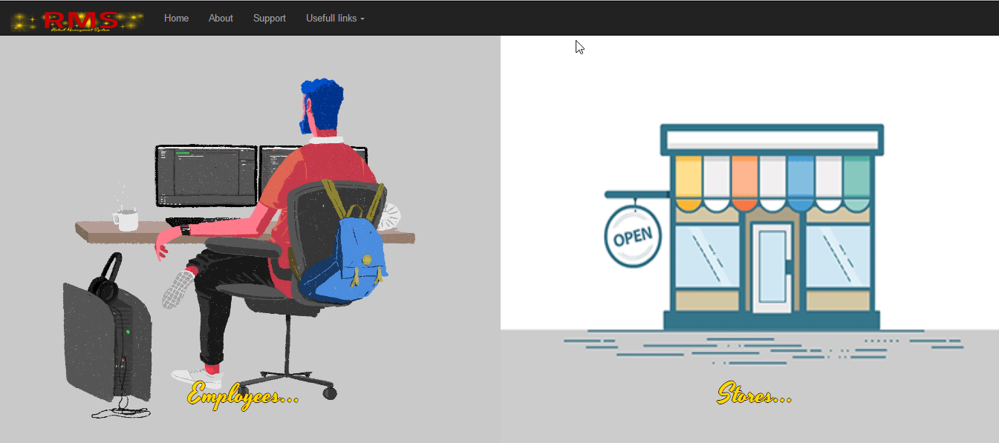
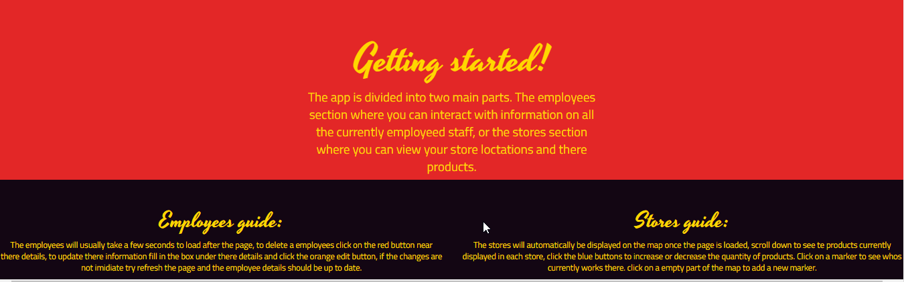

# Retail Managment System - Final Year Project
This is a system for high ranking managers to take care of there stores and staff region-wide or nation-wide, read the full documentation of the project in word by downloading it from above.

## Technologies used:
- Languages: JavaScript,TypeScript,HTML,CSS.
- Libraries: Bootstrap, Mongoose.
- Frameworks: Angular 2.0, ExpressJs.
- Databases: MongoDB.
- Environments: Node.Js.
- NPMs: Mongoose, mongoose-unique-validator.
- Package Managers: Bower.

## Features:
* Full CRUD capabilities with a restful api.
* Fully functional database with restrictions on unvalidated data.
* Asthectic GUI that can display large amounts of data.
* Google maps api with unique user interaction.
* Navigation menu that also lets managers access useful links.

## Documentation chapters:
1. Project Overview.
2. Understanding the technologies.
3. Setting up the project.
4. Architecture and Design.
5. Home Page.
6. Support Page.
7. Store Page.
8. Known Bugs and design flaws.
9. Conclusion.

## Requirements:
* Mongodb installed.
* Nodejs installed.
* Git or git bash to retrieve the project.
* Access to http://127.0.0.1:3000/.

## User Guide

### Running the project:
1. If you havn't already, go to the following links and download the appropriate installer for your system:
* [Download Mongodb](https://www.google.comhttps://www.mongodb.com/download-center?jmp=nav#community)
* [Download NodeJs v6.10](https://nodejs.org/en/)
* [Download GitBash](https://git-scm.com/downloads)
2. Clone the repo from Git to you desired directory.
3. Inside the command prompt, navigate to the folder where the clone was placed and enter npm start.

### App controls:
Home,Support,Employees pages: Typical controls for the browser you use when navigating a web page.

Stores page: The controls for my map are slightly different to interacting with regular Google Maps.
- Click anywhere on the map and enter name of new store to insert a new store.
- Hold the left mouse button and drag to move around the map.
- Put two fingers on the touch pad and move the away from each other to zoom out and towards each other to zoom in.

